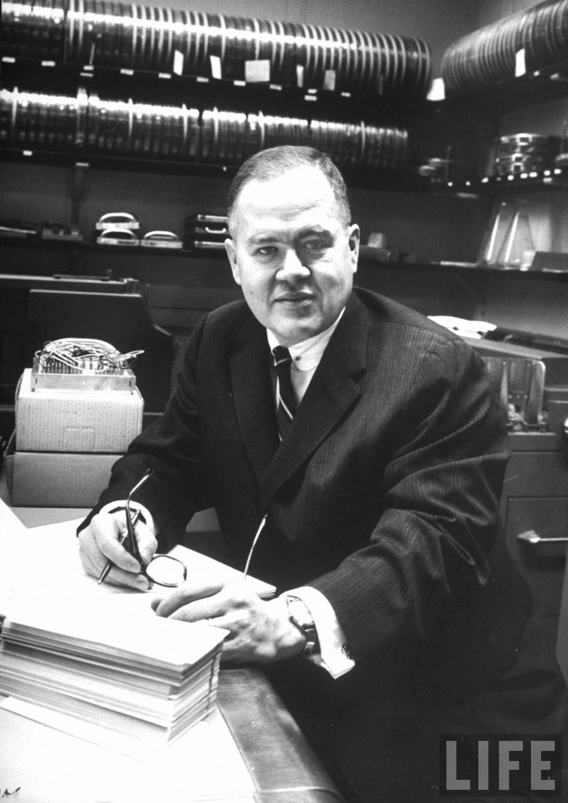
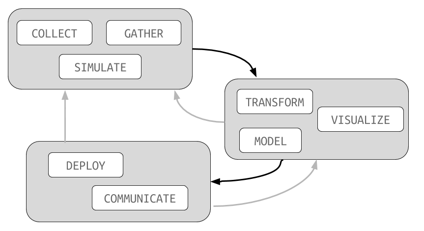

```{r setup, include=FALSE}
knitr::opts_chunk$set(eval = TRUE)
knitr::opts_chunk$set(fig.path = "../assets/class01-introduction-stats/")
knitr::opts_chunk$set(fig.height = 5)
knitr::opts_chunk$set(fig.width = 8.5)
knitr::opts_chunk$set(out.width = "100%")
knitr::opts_chunk$set(dpi = 300)
```

## Learning Objectives

Each set of class notes will contain a list of learning objects. Here are the
objectives for today.

- Explain the goal of applied data analysis.
- Describe at a high-level the three components of the data analysis pipeline.
- Identify key elements of the course structure from the syllabus.
- Inquire about any unclear points or potential concerns.

# Course Description

This course broadly covers the entire process of collecting,
cleaning, visualizing, modeling, and presenting datasets. It
has a MATH designation but is not a *mathematics* course.
The focus is on applied statistics and data analysis
rather than a detailed study of symbolic mathematics.

By the end of the semester you will feel confident collecting,
analyzing, and writing about datasets from a variety of fields.
You will be able to use these skills to address data-driven problems
in a wide range of application domains.

## John Tukey



- "The best thing about being a statistician is that
you get to play in everyone's backyard."

## About me

I am an *applied statistician*. A sampling of projects and datasets
I have worked on include:

- cell phone telemetry
- emergency room patient flow
- finding holes in specialized medical coverage in rural US
- Canadian court case citations
- Olympic figure skating scoring
- auto insurance risk factors
- 170k documentary photographs from the 1930's
- treatment outcomes for open-angle glaucoma
- detecting radicalization from social media data
- financial warfare

We will talk about many of these projects throughout the semester.

## Hans Rosling

Hans Rosling's 200 Countries, 200 Years, 4 Minutes:

- [https://www.youtube.com/watch?v=jbkSRLYSojo](https://www.youtube.com/watch?v=jbkSRLYSojo)

I have shown this to nearly all of my statistics courses, and while
a bit dated it is still the best representation of what this course
is all about.

## NYTimes

Of course, most of our arguments will be in a written form.
For an example of that, see this NYTimes article *Gun homicides
in New Zealand are about as common as deaths from
falling from a ladder in the United States*:

- [http://nyti.ms/28yRifm](http://nyti.ms/28yRifm)

Notice how statistics is used as evidence in a larger arugment.

## FiveThirtyEight

Or, if you like sports, here is the 538 article *Steroids Probably
Aren't Causing Baseball's Power Surge*:

- [http://53eig.ht/2aKodni](http://53eig.ht/2aKodni)

I'll often give those of you interested in a particular subject
(i.e., sports, economics, medicine) the chance to work with data
that matches your interests.

## Statistics in 209

This course is truly about the holistic process of **doing**
statistics. There will be very little mathematical content. For that,
you'll need the MATH329 (Probability) and MATH330 (Statistics)
sequence.

**So, come into this course with an open mind about
what we will be covering. I believe you will find it interesting,
fun, and incredibly useful.**

## Data Analysis

If we are not doing much mathematics, what will we be doing?
We will be covering the basic elements of data analysis:



In order to actually *do* these things, we will work with
the R programming language:


It is freely available for all major operating systems and
is pre-installed on many campus computers.

## Prior projects

To get an idea of the kinds of analysis we'll be working on
here are two projects from other applied statitistics courses
I've taught:

- [Complexity of Shakespeare’s Plays](../assets/project_example_289.html)
- [Fruit/Vegetable Classification](https://statsmaths.github.io/stat395-f17/assets/final_project/dedominicis.html)

I've avoided projects from other 209 courses because we may
re-use some of those datasets. However, the basic structure
of the projects, particularly the first one, is very similar.

# Syllabus

Below I highlight some of the most important elements of the course syllabus.
The full syllabus, which you should consult on your own, is posted on the 
course website.

## Website

All of the materials and assignments for the course will be posted
on the class website:

> https://statsmaths.github.io/stat209-f18

The website contains notes, assignment details, and
supplemental materials. At the end of the semester, this version of
the course will be archived and available for your reference.

## Labs

Most class meetings will have an assignment called a 'lab' associated with it.
These consist of a set of questions that must be answered with either small
snippets of code or short descriptive answers. Often we will start these during
class, though they may sometimes be just for your own practice. Your solutions
must be uploaded to your GitHub page prior to the start of the next class
meeting. Labs are graded on a Pass/Fail scale.

We will start with the first lab during the next class meeting.

## Data Projects

The ultimate aim of the course is to teach you how to *apply* statistics
to real-world questions. To this end, you will complete three data-oriented
projects during the course of the semester. The first two (called 'midterm'
projects) will be shorter in length and consist in you collecting your own
data. Your final project will be longer and will involve producing a tutorial
to introduce a new concept in statistical modeling to your classmates.

## Exams

This course has no exams, final or otherwise.

## Final Grades

The final grade will be determined by weighting the labs and projects as
follows:

- **Labs and Participation**: 20%
- **Midterm Projects**: 40% (20% each)
- **Final Project**: 40%

To pass the course, you must also miss no more than four class meetings.
Attendance requires that you arrive on-time, complete any out of class
assignments for the day, and fully engage with the course material.
Failing to fulfil these attendance requirements may result in a failing
grade of 'V' or a reduction to your final course average at the instructor's
sole discretion.

## Course Policies

The following class policies address some of the most common
questions and concerns that students have. If anything is
unclear, please feel free to contact me for clarification at
any point in the semester.

- **Academic honesty:** Cheating and plagiarism are grave scholarly
offenses and potential grounds
for expulsion; they are also a major barrier to your intellectual development.
You are expected to familiarize yourself with the entirety of the
University of Richmond’s Honor Code. If you are confused or unsure about
appropriate citation protocol or any other aspect of the Honor code,
please consult me before turning in an assignment.
- **Special approval:** If you have special approval forms for extra
time on exams or any other circumstances I should know about, please speak
with me as early as possible so that we can best accommodate your needs.
- **Late work:** You are expected to submit all work on-time. Late reports
will be accepted after the due date with a full letter grade deduction for each
24 hour period it is late (rounded up).
- **Attendance:** You are expected to both attend and participate in most
class meetings. If you must be absent due to illness or other pressing
need, please let me know by email as soon as possible. A habit of arriving
late, failing to participate, or failing to accomplish any out of class assignments
is considered equivalent to an absence.
- **Make-up work:** In instances where students have a valid excuse for
missing a quiz, please arrange to meet with me as soon as possible.
- **Class conduct:** During class I expect you to refrain from checking
email, being on phones, or working on assignments for other classes.
- **Computers:** I except you to bring a working laptop with R and 
RStudio installed. If this poses a challenge, please speak with me at the 
start of the semester or as new problems arise.
- **Office hours:** Rather than fixed weekly office hours, I will 
provide blocks of open times to meet with me particularly focused around
project due dates. If you find me in my office, poke your head in and I
am usually happy to meet on the spot. Otherwise, please email me to make an
appointment so that we can chat. Please note that appointments should
be booked at least 24 hours ahead of time.
- **Email:** I will also answer questions by email (it can, in fact,
be much faster than scheduling an appointment for small issues). During the
week, I aim to respond within 24 hours, with emails sent over the weekend
responded to by Monday morning. If your question involves code, please attach
your current lab or report as that will expedite my answering your question(s).

These address some of the most common questions and concerns that
students have. If anything is unclear, please feel free to contact
me for clarification at any point in the semester.

## For next time

Please bring a laptop with an updated version of your operating system to our
next class meeting. If this is not possible please stick around and speak with
me at the end of the class.

