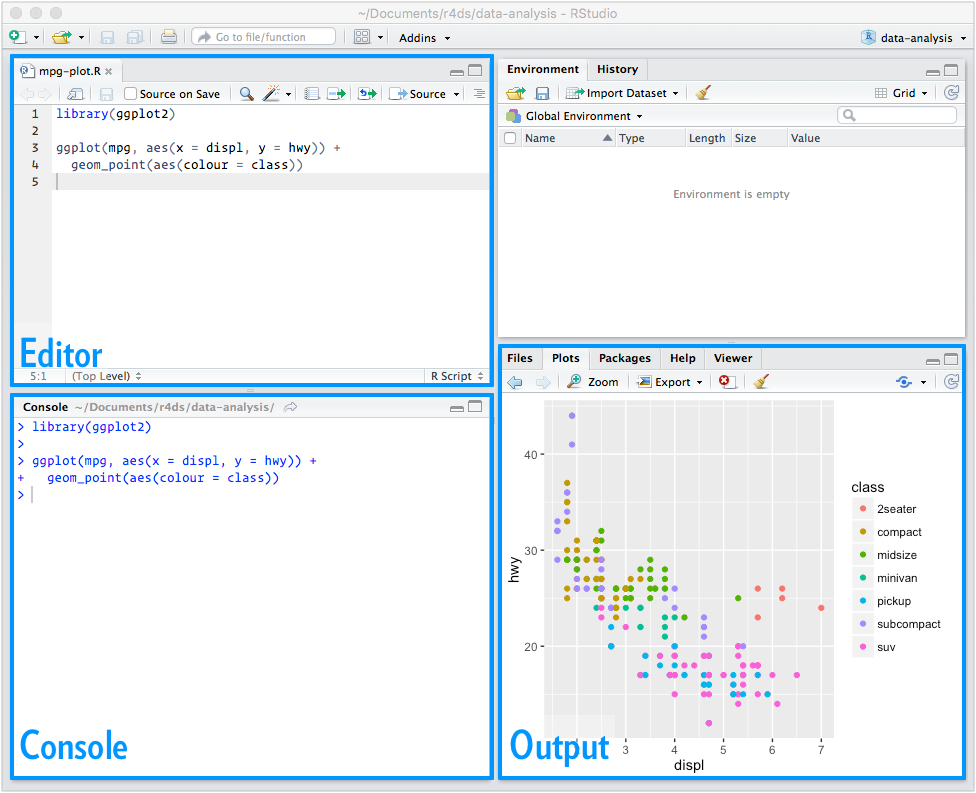

```{r setup, include=FALSE}
knitr::opts_chunk$set(eval = TRUE)
knitr::opts_chunk$set(fig.path = "../assets/class01-introduction-stats/")
knitr::opts_chunk$set(fig.height = 5)
knitr::opts_chunk$set(fig.width = 8.5)
knitr::opts_chunk$set(out.width = "100%")
knitr::opts_chunk$set(dpi = 300)
```

## Learning Objectives

Each set of class notes will contain a list of learning objects. Here are the
objectives for today.

- Identify key elements of the course structure from the syllabus.
- Inquire about any unclear points or potential concerns.
- Create GitHub account and class repository
- Install R and RStudio on your computer
- Open, edit, and run an RMarkdown file
- Upload lab assignment to GitHub

# Course Description

This course broadly covers the entire process of collecting,
cleaning, visualizing, modeling, and presenting datasets. It
has a MATH designation but is not a *mathematics* course.
The focus is on applied statistics and data analysis
rather than a detailed study of symbolic mathematics.

By the end of the semester you will feel confident collecting,
analyzing, and writing about datasets from a variety of fields.
You will be able to use these skills to address data-driven problems
in a wide range of application domains.

## GitHub

If you do not already have an account, go to the main webpage and create a
free account. Try to pick a professional name as you may find that you want
to make this public at some point:

- [https://github.com/](https://github.com/)

Next, follow this link and accept the invitation:

- [https://classroom.github.com/a/Swa5EJWV](https://classroom.github.com/a/Swa5EJWV)

Assuming you have a valid GitHub account, this will set up a repository where
all of your projects for this semester should be posted.

## Create Workspace

Now, either download the entire repository as a zip file. If GitHub is being a pain,
you can also download the
[zip file directly](https://github.com/statsmaths/stat209-template/archive/master.zip).
Either way, put the results somewhere
on your computer that you can easily find and save. You’ll put all of the materials
from this class inside that folder.

# Setting up R

## Download software

The first step is to download the R programming language. To do
this go to [https://cran.r-project.org/](https://cran.r-project.org/)
and select your platform:


For macOS, just download R-3.5.1 (or whatever is the most recent):


For Windows, first select **base**


And then *Download R 3.5.1*


One you have the .pkg (macOS) or .exe (Windows) file,
install this on your computer according to the default
settings.

## RStudio

The files we just downloaded are the core R language files
doing all the hard work of processing data. Next, we'll
install a helpful GUI frontend that make calling R easier.

Go to [https://www.rstudio.com/](https://www.rstudio.com/).
Click on Products => RStudio.


Scroll down to the **DOWNLOAD RSTUDIO DESKTOP** button
and click on it.


Scroll down again to the **Installers for Supported Platforms**.
The Windows link gives you an exe:


And the macOS link gives a dmg:


Now, install R or RStudio as you would any other program. It
should link automatically to the version of R you just
installed.

## RMarkdown

We are going to work through the first lab together now.

The idea of an Rmarkdown file is that we can integrate code and text together.
This makes it self-documenting and allows analyses to be reproducible. Navigate
to the zipped file you had from GitHub and open the file "lab/lab01.Rmd".
You should be able to double click it and the file will open automatically.

You should see screen like this (its a screen shot from my Mac, but looks very
similar on Windows):



We will now walk through the markdown file and explain how to run code, install
R packages, and submit your results.

## Questions

As a last task for today, please complete the brief questionnaires I am handing
out.

