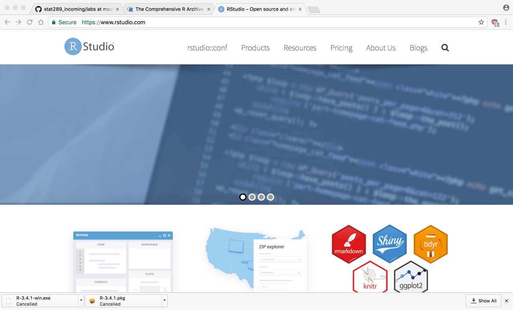
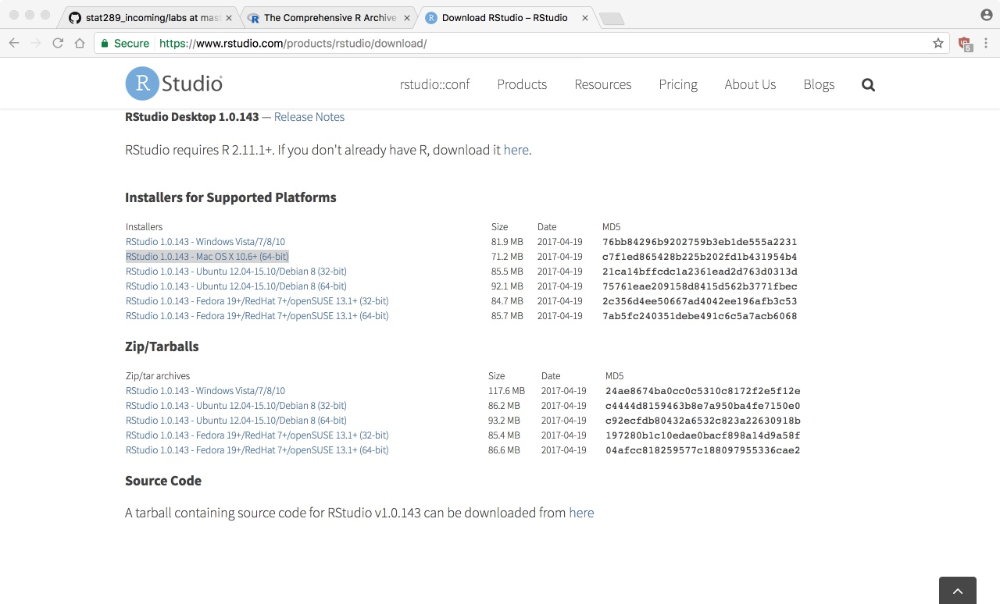
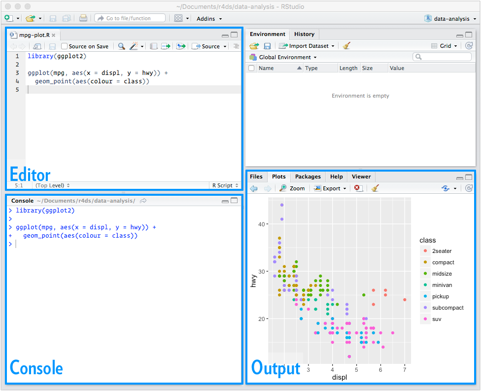

## Learning Objectives

Each set of class notes will contain a list of learning objects. Here are the
objectives for today.

- Identify key elements of the course structure from the syllabus.
- Inquire about any unclear points or potential concerns.
- Create GitHub account and class repository
- Install R and RStudio on your computer
- Open, edit, and run an RMarkdown file
- Upload lab assignment to GitHub

# Course Description

This course broadly covers the entire process of collecting,
cleaning, visualizing, modeling, and presenting datasets. It
has a MATH designation but is not a *mathematics* course.
The focus is on applied statistics and data analysis
rather than a detailed study of symbolic mathematics.

By the end of the semester you will feel confident collecting,
analyzing, and writing about datasets from a variety of fields.
You will be able to use these skills to address data-driven problems
in a wide range of application domains.

## GitHub

If you do not already have an account, go to the main webpage and create a
free account. Try to pick a professional name as you may find that you want
to make this public at some point:

- [https://github.com/](https://github.com/)

Next, follow this link and accept the invitation:

- [https://classroom.github.com/a/Swa5EJWV](https://classroom.github.com/a/Swa5EJWV)

Assuming you have a valid GitHub account, this will set up a repository where
all of your projects for this semester should be posted.

## Create Workspace

Now, either download the entire repository as a zip file. If GitHub is being a pain,
you can also download the
[zip file directly](https://github.com/statsmaths/stat209-template/archive/master.zip).
Either way, put the results somewhere
on your computer that you can easily find and save. You’ll put all of the materials
from this class inside that folder.

# Setting up R

## Download software

The first step is to download the R programming language. To do
this go to [https://cran.r-project.org/](https://cran.r-project.org/)
and select your platform:

For macOS, just download R-3.5.1 (or whatever is the most recent):

For Windows, first select **base**

And then *Download R 3.5.1*

One you have the .pkg (macOS) or .exe (Windows) file,
install this on your computer according to the default
settings.

## RStudio

The files we just downloaded are the core R language files
doing all the hard work of processing data. Next, we'll
install a helpful GUI frontend that make calling R easier.

Go to [https://www.rstudio.com/](https://www.rstudio.com/).
Click on Products => RStudio.

Scroll down to the **DOWNLOAD RSTUDIO DESKTOP** button
and click on it.

Scroll down again to the **Installers for Supported Platforms**.
The Windows link gives you an exe:

And the macOS link gives a dmg:

Now, install R or RStudio as you would any other program. It
should link automatically to the version of R you just
installed.

## RMarkdown

We are going to work through the first lab together now. Click on the link
below to download the file:

<a href="https://raw.githubusercontent.com/statsmaths/stat209-f18/master/labs/lab01.Rmd" download="lab01.Rmd" target="_blank">lab01.Rmd</a>

The idea of an Rmarkdown file is that we can integrate code and text together.
This makes it self-documenting and allows analyses to be reproducible. Save
this in a file on your computer and open it in RStudio (you should be able to
double click it and the file will open automatically).

You should see screen like this (its a screen shot from my Mac, but looks very
similar on Windows):

We will now walk through the markdown file and explain how to run code, install
R packages, and submit your results.

## Questions

As a last task for today, please complete the brief questionnaires I am handing
out.

