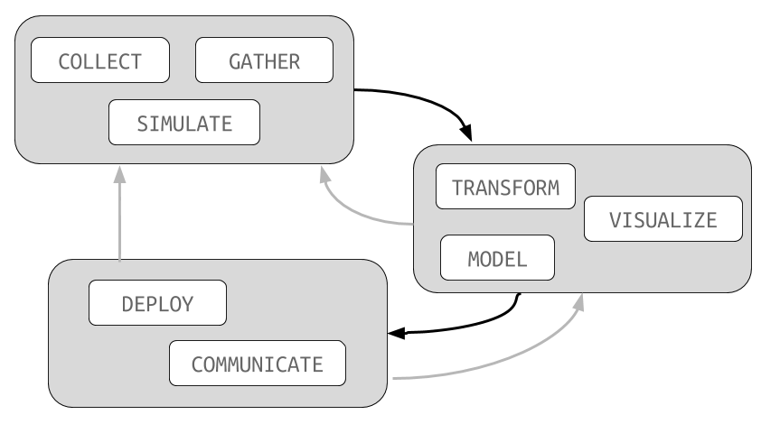

## Learning Objectives

- Explain the goal of applied data analysis.
- Describe at a high-level the three components of the data analysis pipeline.
- Practice using R and GitHub.

## Hans Rosling

Hans Rosling's 200 Countries, 200 Years, 4 Minutes:

- [https://www.youtube.com/watch?v=jbkSRLYSojo](https://www.youtube.com/watch?v=jbkSRLYSojo)

I have shown this to nearly all of my statistics courses, and while
a bit dated it is still the best representation of what this course
is all about.

## NYTimes

Of course, most of our arguments will be in a written form.
For an example of that, see this NYTimes article *Gun homicides
in New Zealand are about as common as deaths from
falling from a ladder in the United States*:

- [http://nyti.ms/28yRifm](http://nyti.ms/28yRifm)

Notice how statistics is used as evidence in a larger arugment.

## FiveThirtyEight

Or, if you like sports, here is the 538 article *Steroids Probably
Aren't Causing Baseball's Power Surge*:

- [http://53eig.ht/2aKodni](http://53eig.ht/2aKodni)

I'll often give those of you interested in a particular subject
(i.e., sports, economics, medicine) the chance to work with data
that matches your interests.

## Statistics in 209

This course is truly about the holistic process of **doing**
statistics. There will be very little mathematical content. For that,
you'll need the MATH329 (Probability) and MATH330 (Statistics)
sequence.

**So, come into this course with an open mind about
what we will be covering. I believe you will find it interesting,
fun, and incredibly useful.**

## Data Analysis

If we are not doing much mathematics, what will we be doing?
We will be covering the basic elements of data analysis:

In order to actually *do* these things, we will work with
the R programming language:

It is freely available for all major operating systems and
is pre-installed on many campus computers.

## Prior projects

To get an idea of the kinds of analysis we'll be working on
here are two projects from other applied statitistics courses
I've taught:

- [Complexity of Shakespeare’s Plays](../assets/project_example_289.html)
- [Fruit/Vegetable Classification](https://statsmaths.github.io/stat395-f17/assets/final_project/dedominicis.html)

I've avoided projects from other 209 courses because we may
re-use some of those datasets. However, the basic structure
of the projects, particularly the first one, is very similar.

# R Basics

Today we begin our formal study of using the R programming language to analyze
data. There are two basic philosophies regarding how to teach R: (1) working
from the ground up, methodically going through each function and command one
by one or (2) learning by immersion, starting with short by complete examples
and working backwards to fill in the gaps.

We will start by the immersion method because it is both more interesting
and generally leads to a better understanding of how to do statistical
computing. Throughout the semester we will go back and fill in any remaining
details as needed.

## Assignment

Your assignment, which we may start in class, is to complete and submit the
second lab. You can find this lab here:

<a href="https://raw.githubusercontent.com/statsmaths/stat209-f18/master/labs/lab02.Rmd" download="lab02.Rmd" target="_blank">lab02.Rmd</a>

If you run into any problems please email me as soon as possible.

