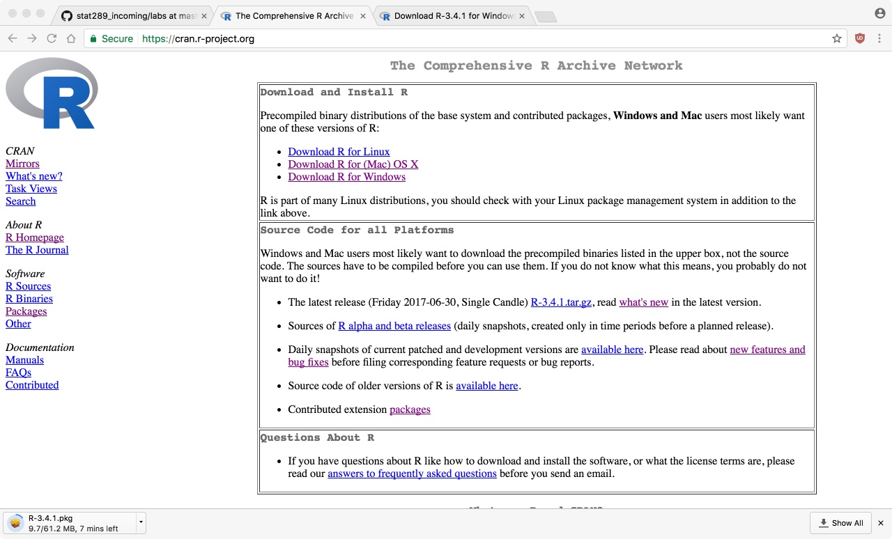
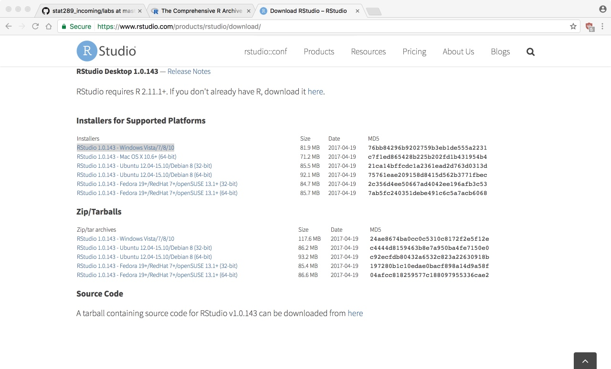

## Learning Objectives

- Create GitHub account and class repository
- Install R and RStudio on your computer
- Open, edit, and run an RMarkdown file
- Upload lab assignment to GitHub

## GitHub

If you do not already have an account, go to the main webpage and create a
free account. Try to pick a professional name as you may find that you want
to make this public at some point:

- [https://github.com/](https://github.com/)

Next, follow this link and accept the invitation:

- [https://classroom.github.com/a/Swa5EJWV](https://classroom.github.com/a/Swa5EJWV)

Assuming you have a valid GitHub account, this will set up a repository where
all of your projects for this semester should be posted.

# Setting up R

## Download software

The first step is to download the R programming language. To do
this go to [https://cran.r-project.org/](https://cran.r-project.org/)
and select your platform:

For macOS, just download R-3.5.1 (or whatever is the most recent):

For Windows, first select **base**

And then *Download R 3.5.1*

One you have the .pkg (macOS) or .exe (Windows) file,
install this on your computer according to the default
settings.

## RStudio

The files we just downloaded are the core R language files
doing all the hard work of processing data. Next, we'll
install a helpful GUI frontend that make calling R easier.

Go to [https://www.rstudio.com/](https://www.rstudio.com/).
Click on Products => RStudio.

Scroll down to the **DOWNLOAD RSTUDIO DESKTOP** button
and click on it.

Scroll down again to the **Installers for Supported Platforms**.
The Windows link gives you an exe:

And the macOS link gives a dmg:

Now, install R or RStudio as you would any other program. It
should link automatically to the version of R you just
installed.

# R Basics

Today we begin our study of using the R programming language to analyze
data. There are two basic philosophies regarding how to teach R: (1) working
from the ground up, methodically going through each function and command one
by one or (2) learning by immersion, starting with short by complete examples
and working backwards to fill in the gaps.

We will start by the immersion method because it is both more interesting
and generally leads to a better understanding of how to do statistical
computing. Throughout the semester we will go back and fill in any remaining
details as needed.

## RMarkdown

We are going to work through the first lab together now. Click on the link
below to download the file:

<a href="https://raw.githubusercontent.com/statsmaths/stat209-f18/master/labs/lab01.Rmd" download="lab01.Rmd" target="_blank">lab01.Rmd</a>

The idea of an Rmarkdown file is that we can integrate code and text together.
This makes it self-documenting and allows analyses to be reproducible. Save
this in a file on your computer and open it in RStudio (you should be able to
double click it and the file will open automatically).

You should see screen like this (its a screen shot from my Mac, but looks very
similar on Windows):

We will now walk through the markdown file and explain how to run code, install
R packages, and submit your results.

## Assignment

The lab numbers correspond to the course numbers, so you actually just
submitted the lab associated with the first day of class. Your assignment,
which we may start in class, is to complete and submit the second lab. You
can find this lab here:

<a href="https://raw.githubusercontent.com/statsmaths/stat209-f18/master/labs/lab02.Rmd" download="lab02.Rmd" target="_blank">lab02.Rmd</a>

If you run into any problems please email me as soon as possible.
