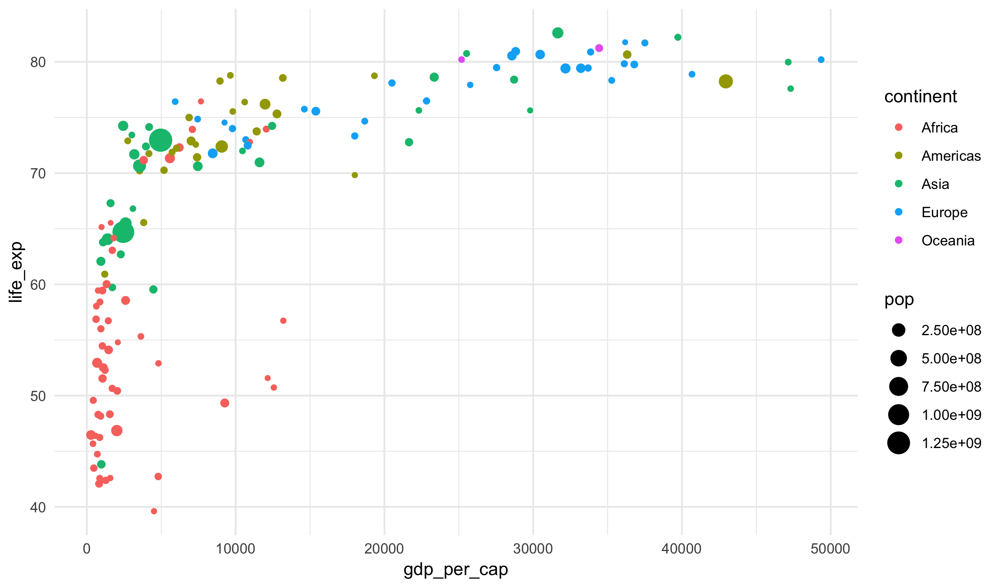

## Learning Objectives

- 

## Data Aesthetics

Let's again look at a subset of the data that Hans Roslin used in the video I showed on
the first day of class.


gapminder_2007 <- read_csv("https://statsmaths.github.io/stat_data/gapminder_2007.csv")



## Parsed with column specification:
## cols(
##   country = col_character(),
##   continent = col_character(),
##   life_exp = col_double(),
##   pop = col_integer(),
##   gdp_per_cap = col_double()
## )



gapminder_2007



## # A tibble: 142 x 5
##    country     continent life_exp       pop gdp_per_cap
##    <chr>       <chr>        <dbl>     <int>       <dbl>
##  1 Afghanistan Asia          43.8  31889923        975.
##  2 Albania     Europe        76.4   3600523       5937.
##  3 Algeria     Africa        72.3  33333216       6223.
##  4 Angola      Africa        42.7  12420476       4797.
##  5 Argentina   Americas      75.3  40301927      12779.
##  6 Australia   Oceania       81.2  20434176      34435.
##  7 Austria     Europe        79.8   8199783      36126.
##  8 Bahrain     Asia          75.6    708573      29796.
##  9 Bangladesh  Asia          64.1 150448339       1391.
## 10 Belgium     Europe        79.4  10392226      33693.
## # ... with 132 more rows


Last time we saw how to make plots using the grammar of graphics, such as this
scatter plot:


ggplot(gapminder_2007, aes(gdp_per_cap, life_exp)) +
  geom_point()


We discussed how in the first line the variable `gdp_per_cap` is mapped to the x-axis
and `life_exp` is mapped to the y-axis. One powerful feature of the grammar of graphics
is the ability to map variables into other graphical parameters. These are called
"aesthetics" (that is what the `aes()` function stands for) and we already saw one example
last time with the `geom_text` function.

For example, we can change the color of the points to correspond to a variable in the 
dataset like this:


ggplot(gapminder_2007, aes(gdp_per_cap, life_exp)) +
  geom_point(aes(color = continent))


Or change the size to match the population. Note that R writes the population
key in scientific notation (2.5e+08 is the same as 2.5 time 10 to the power of
eight).


ggplot(gapminder_2007, aes(gdp_per_cap, life_exp)) +
  geom_point(aes(size = pop))


Or, finally, we could change both the size and color.


ggplot(gapminder_2007, aes(gdp_per_cap, life_exp)) +
  geom_point(aes(size = pop, color = continent))


## Scales

We can control the exact color choosen in the plot using a layer type known as 
a scale. For example, the color pallet used with the **viridis** package can be
used to change the colors choosen in a plot:


ggplot(gapminder_2007, aes(gdp_per_cap, life_exp)) +
  geom_point(aes(color = life_exp)) +
  scale_color_viridis()


The viridis color pallet is optimized for readability for people who are color blind.
It also improves the plot when printed in black and white or projected on a badly
tuned projector.

## Prototype and References

If you would like more references, here is a cheat-sheet and online notes that
extend what we have done today:

- [ggplot2 cheatsheet](https://github.com/rstudio/cheatsheets/raw/master/data-visualization-2.1.pdf)
- [R4DS: Data Viz](http://r4ds.had.co.nz/data-visualisation.html)

These cover much more than we have shown today, and you are only responsible
for the notes here. However, you may find the exercises and examples useful
if this material is new to you.

